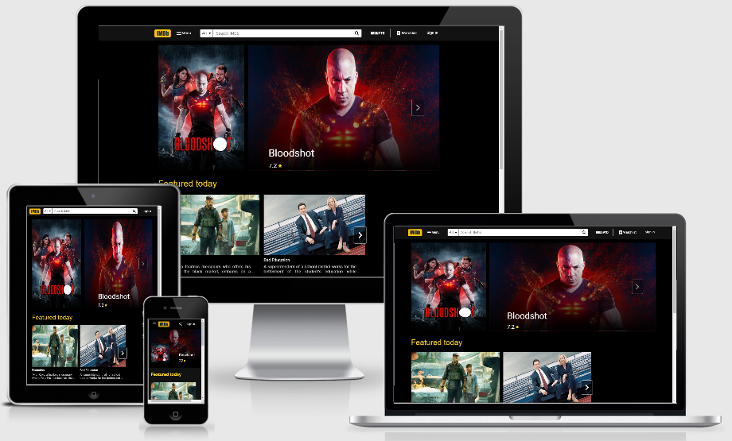

# IMDb Clone
Demo - https://imdb-react-clone.herokuapp.com/

This React project is a simplified front-end version of the IMDb website. It uses [The MovieDB Api](https://www.themoviedb.org/documentation/api) to search for movies and display results.

### Stack used:
- React: UI framework
- Redux: State management
- Redux-Saga: Handle side effects
- Axios: Make API calls
- Bootstrap: CSS Framework
- Node Sass: Advanced CSS
- Firebase: Authentication

### Features:
- User can see all the latest movies and tv shows.
- User can search for movies
- User can sign up on the website
- User can sign in on the website using either:
  - email/pass created during sign up
  - third party providers (Google, Facebook and Github)
- The site supports any screen size

### Video Walkthrough
#### Desktop view

#### Mobile view

#### Feel free to create a pull request and submit any issues!
